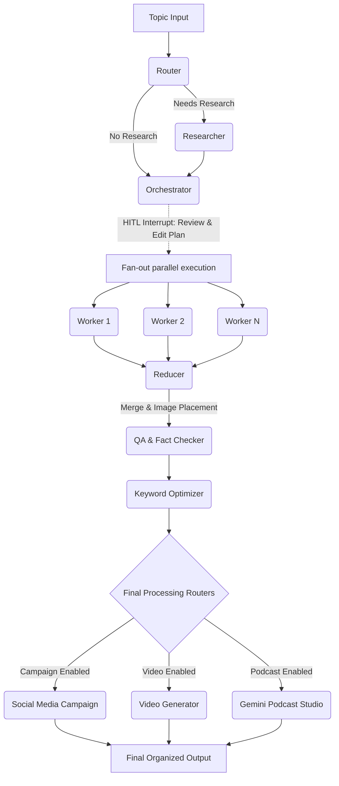

# 🚀 AI Content Factory: Multi-Agent Blog & Media Generator


A powerful, multi-agent AI engine built with **LangGraph** designed to automate the entire lifecycle of content creation. This system serves as a **Final Year Project (FYP)** demonstrating an advanced stateful, multi-agent orchestration pattern. 

From a single topic prompt, the AI Content Factory orchestrates specialized agents to autonomously query the web, fact-check data, generate a rich-text blog post, synthesize a multi-speaker AI podcast, produce dynamic short-form videos, and write platform-specific social media campaigns.

---

## 🌟 Key Features

* **Multi-Modal Generation:** Generates text (Blogs, SEO, Socials), Images (Contextual inline placement), Audio (Conversational Podcasts via Gemini 2.5 Flash), and Video (Pexels B-roll + TTS + Subtitles).
* **Intelligent Web Research:** Autonomously queries the web via Tavily to gather real-time data, citations, and evidence before outlining.
* **Human-in-the-Loop (HITL):** The system securely halts execution to present a drafted outline to the user, allowing custom edits and approval before costly generation operations begin.
* **AI Podcast Studio (New!):** Leverages the `google-genai` SDK and **Gemini 2.5 Flash native audio** to generate an engaging, 3-minute solo podcast discussing the generated blog in a natural, conversational tone.
* **Cost-Saving Toggles:** Built-in CLI toggles allow users to easily disable token-heavy or API-intensive tasks (e.g., Video, Podcast, Campaign) to conserve API usage.
* **Quality Assurance & Fact-Checking:** An elite QA Agent automatically audits the combined blog against the original gathered evidence, scoring it for readability, structure, and factual accuracy.
* **Domain-Agnostic Engine:** Capable of producing specialized content (technical, educational, conversational, persuasive) across any domain by selecting targeted writing tones.

---

## 📐 System Architecture

The application uses a highly scalable, stateful, and interruptible state machine to manage the complexity of multi-agent interactions.



**Key Architectural Highlights:**
- **LangGraph Infrastructure:** Stateful agent workflows allow pausing, resuming, and sophisticated state management across concurrent pipelines.
- **Parallel Processing:** A fan-out architecture dispatches blog sections to individual Worker agents concurrently, drastically reducing text generation time.

---

## 🤖 The Agents Roster

| Agent                 | Core Model                 | Primary Responsibility                                                                                      |
| --------------------- | -------------------------- | ----------------------------------------------------------------------------------------------------------- |
| **Router**            | `gpt-4o-mini`              | Evaluates the initial prompt and decides if supplementary web research is necessary before outlining.       |
| **Researcher**        | `gpt-4o-mini` + Tavily     | Scours the internet to gather contextual data, contemporary facts, and reliable citations.                  |
| **Orchestrator**      | `gpt-4o-mini`              | Designs the structural outline and sections (halts for user HITL review).                                   |
| **Worker (xN)**       | `gpt-4o-mini`              | Writes assigned sections independently and in parallel for rapid document assembly.                         |
| **Reducer**           | `gpt-4o-mini`              | Merges sections logically. Contextually prompts and places generated inline images.                         |
| **QA / Auditor**      | `gpt-4o-mini`              | Audits the final merged text against raw evidence, assigning a quantifiable quality score.                  |
| **Keyword Optimizer** | `gpt-4o-mini`              | Enhances SEO by strategically placing user-defined target keywords throughout the content.                  |
| **Campaign Gen.**     | `gpt-4o-mini`              | Transforms the blog's core message into tailored tweets, emails, and LinkedIn posts.                        |
| **Podcast Studio**    | `Gemini 2.5 Flash`         | **[NEW]** Synthesizes a native, high-quality audio podcast discussing the content using Gemini's audio API. |
| **Video Generator**   | `gpt-4o-mini` + Speech API | Writes a voiceover script, fetches stock b-roll, synthesizes audio, and layers captions via MoviePy.        |

---

## 🗂️ Project Structure

```text
Multi_Agent_Blog_generator_FYP/
├── Agents_backend/
│   ├── main.py                  # Main CLI entry point & Graph orchestrator
│   ├── validators.py            # Topic validation and quality assertions
│   │
│   ├── Graph/
│   │   ├── state.py             # LangGraph State TypedDict & Pydantic models
│   │   ├── nodes.py             # All core agent node exports
│   │   ├── templates.py         # System prompts and role instructions
│   │   ├── podcast_studio.py    # Native Gemini Audio generator
│   │   ├── structured_data.py   # Schemas for structured data parsing
│   │   ├── keyword_optimizer.py # SEO & keyword integration logic
│   │   │
│   │   └── agents/              # Individual worker agent definitions
│   │       ├── quality_control.py
│   │       ├── research.py
│   │       ├── video.py
│   │       └── ...
│   │
│   └── blogs/                   # Automatically generated, structured outputs
├── requirements.txt             # Python dependencies
├── .env                         # Environment variables mapping (API keys)
└── readme.md                    # Project documentation
```

---

## ⚙️ Setup & Installation

### Prerequisites
* **Python 3.11+**
* **ffmpeg:** Strongly required for video generation and audio pipeline manipulation. Must be accessible in your system `PATH`.
* **ImageMagick:** (Optional/Recommended) Required for advanced MoviePy text effects if you plan on modifying caption styles.

### 1. Install Dependencies

```bash
git clone <repository_url>
cd Multi_Agent_Blog_generator_FYP
pip install -r requirements.txt
# Ensure you have the latest google-genai package for podcast support
pip install google-genai
```

### 2. Configure Environment Variables

Create an `Agents_backend/.env` file with the following API keys:

```ini
OPENAI_API_KEY=sk-...       # Required: Core LLM reasoning for Text & Graph routing
TAVILY_API_KEY=tvly-...     # Required: Web research scraper
GOOGLE_API_KEY=AIzaSy...    # Required: Used by Podcast Studio, Image Gen, and Video TTS (Gemini)
PEXELS_API_KEY=...          # Required: B-roll stock video fetching
```

> ⚠️ **One key for all Google/Gemini services.** `GOOGLE_API_KEY` is used by the
> Podcast Studio, the Image Generator, and the Video voiceover — do **not** create
> a separate `GEMINI_API_KEY`. Any previous `.env` files using `GEMINI_API_KEY`
> must be updated to `GOOGLE_API_KEY`.

---

## 🚀 Usage Guide

The AI Content Factory is driven by a powerful CLI.

### Command Line Interface (CLI)
Run the interactive CLI process which guides you through topic validation, tone selection, target sections, cost-saving feature toggles (Podcast, Video, Campaign), and allows you to utilize the Human-in-the-loop plan review.

```bash
cd Agents_backend
python main.py
```

---

## 📝 Example Output Folder Flow

Generating a blog on `"Quantum Computing"` will yield an isolated, neatly organized directory with everything ready for publication:

```text
blogs/quantum_computing_20260302_083000/
├── README.md                                 # Overview & metrics of this run
├── content/
│   └── quantum_computing.md                  # Final rich-text blog post with placed images
├── social_media/
│   ├── linkedin_quantum_computing.txt
│   ├── twitter_quantum_computing.md
│   ├── landing_page_quantum_computing.md
│   └── email_quantum_computing.md
├── reports/
│   ├── qa_report.txt                         # Detailed fact-checking breakdown/score
│   └── keyword_optimization.txt              # SEO density report
├── research/
│   └── evidence.json                         # Sources scraped and cached from Tavily
├── audio/
│   └── podcast.wav                           # Engaging Solo AI Podcast via Gemini Flash
├── video/
│   └── short.mp4                             # Ready-to-upload TikTok/Reels format MP4
└── metadata/
    ├── plan.json                             # The approved Orchestrator plan
    └── metadata.json                         # Execution traces, tokens, and configs
```

---

## ⚠️ Known Limitations

* **In-Memory State:** By default, LangGraph utilizes `MemorySaver`. Restarting the application/API server clears active job history and ongoing graph states. (For production, implement a Postgres checkpointer).
* **Security & Auth:** The FastAPI instance does not currently implement authentication and permits unrestricted CORS (`allow_origins=["*"]`). Please secure behind an API gateway or reverse proxy for any public deployments.
* **System Binaries:** If `ffmpeg` is not correctly installed on the host OS, the final Video/Audio nodes may fail. Ensure system binaries are configured properly prior to starting.

---

## 🎓 Academic Context (FYP)

This repository serves as a showcase of modern **Artificial Intelligence engineering**. It moves beyond simple "wrapper" applications by introducing autonomous agentic decision-making, parallel LLM execution, recursive self-correction (QA grading), and multi-modal integrations encompassing text, visual, and spatial audio synthesis.

## 📄 License

This project is licensed under the Apache 2.0 License — see the [LICENSE](LICENSE) file for complete details.